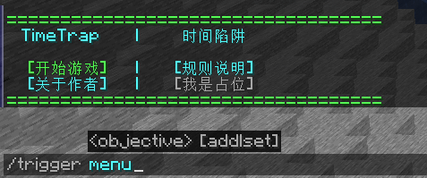
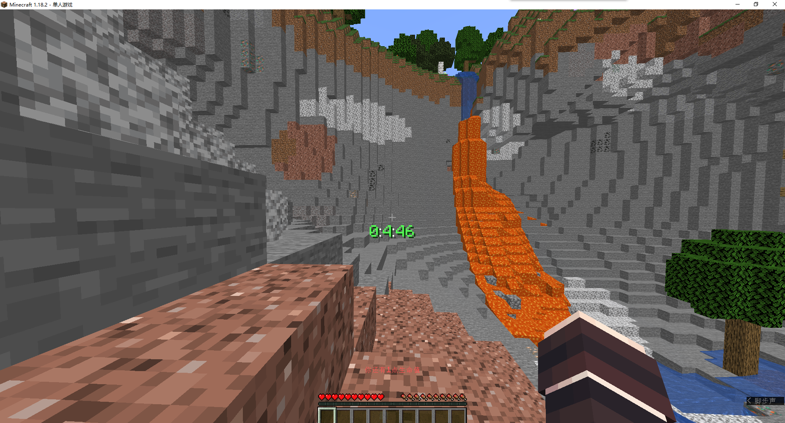
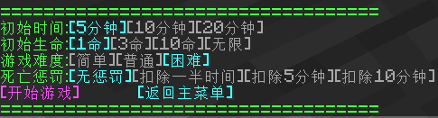

# Datapack-1.15-1.18-TimeTrap
## Time Trap - Fast Pace Survival Challenge

**A Race Against The Clock, Fast Paced, High Blood Pressure Survival Challenge**

**Produced In Version 1.18.2**

### Compatibility Test (v1.0.1):

- 1.19.2 Can operate normally (predicted)

- 1.18.2 Can operate normally

- 1.16.1 Can operate normally

- 1.15 Can operate normally

- 1.14 Unable to operate normally

- 1.13 Unable to operate normally

### This Datapack Has The Following Elements:

- Iron Ore Refugee 

- My Time 

- Food Refugee 

- Dream Start

- Quick Connect Paradise

- Happy Friends

- Extreme Overtime

- Don't look at the instructions

## How To Get Started

Put the data package into non limit mode archive first

Cheating can be turned off (but it is best to turn it on)

` /reload ` or ` /trigger menu ` can both call up menus

The menu will vary under different game states

## Game Rules

Select the difficulty factor first, and then click [开始游戏] to start the game

After starting the game, it will transfer the player to the birth point and restore health and hunger points

Your time in the middle of the screen

The game ends when time runs out/life runs out

**You can increase time by throwing minerals one by one into the medicine refining pot**

(Only one must be lost or it will waste time)

## Difficulty Setting

Modify the parameters before starting the game to modify the difficulty factor

Difficulty factors affect the final rating

[初始时间] Determines the initial time after starting the game

Multiplication: 1.1 1.0 0.9

[初始生命] Determines the number of times you can die

Multiplication: 1.3 1.2 1.1 1.0

[游戏难度] Determines the time available for sacrificing items

Multiplication: 0.9 1.0 1.1

[死亡惩罚] The punishment obtained after death

Multiplication: No magnification

## Increase Time

**[简单]Easy [普通]Ordinary [困难]Difficult**

- Iron ingot   **40         30             20**

- Gold ingot   **60         50             40**

- Diamond      **120        90             60**

- Copper ingot **20         15             10**

- Alloy        **360        300            240**
